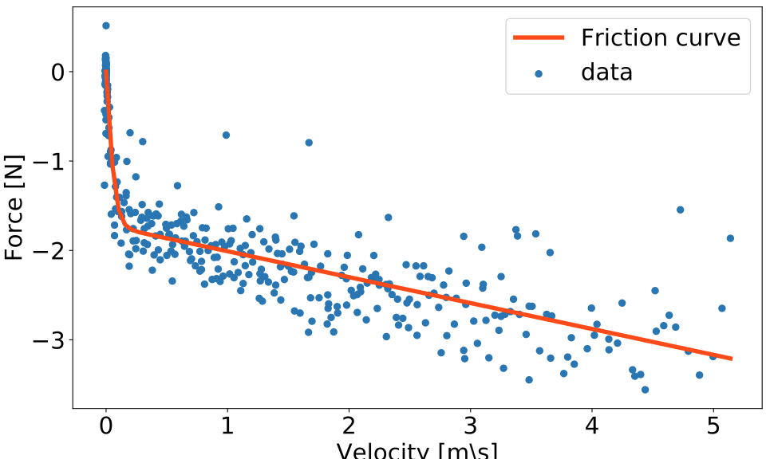
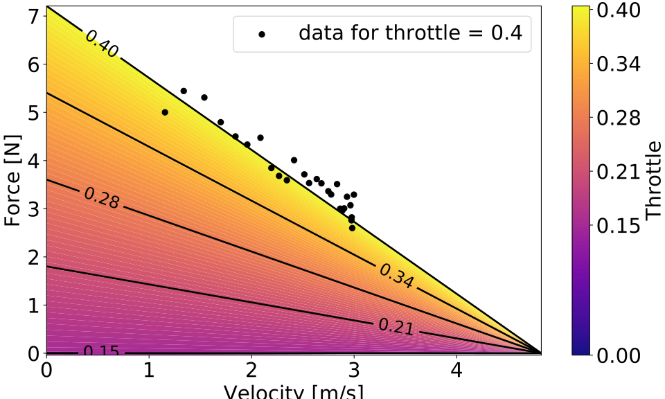
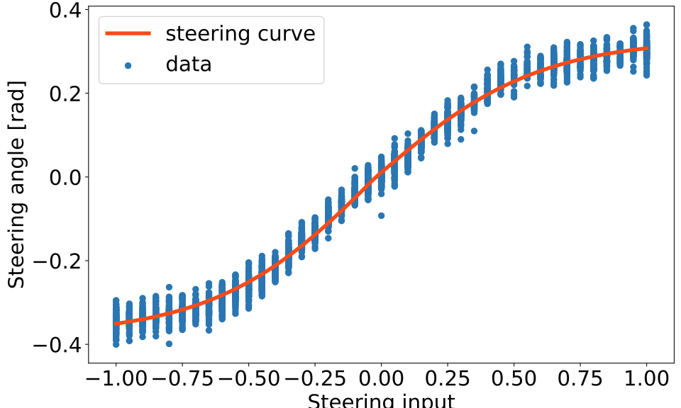
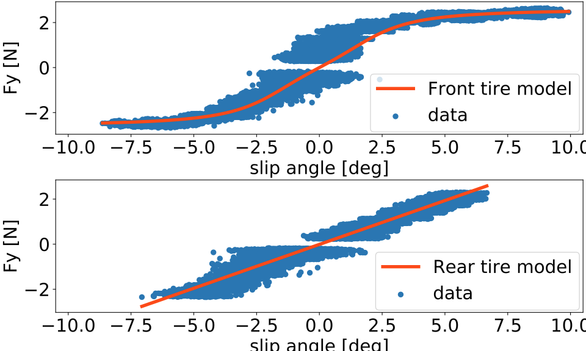

# DART: Delft's Autonomous-driving Robotic Testbed

<p align="center">
  
</p>


## What's DART?
DART is a small-scale car-like robot that is intended for autonomous driving research. It's based on the commercially available [JetracerPro AI kit](https://www.waveshare.com/wiki/JetRacer_Pro_AI_Kit)  available from Waveshare and features  additional sensors and a few other upgrades. Instructions on how to build your own will be available soon. 


## What's in this repo?
This repository contains the code to set up and start driving with DART! In particular you can find:
- **ROS packages** that can be deployed on the platform to quicky get you started on your experiments. They feature basic functionalities, low level, high level controllers and a lidar-based SLAM pipeline.
- **Simulator** to test and debug before heading out to the lab. It replicates the sensor readings you would get from the vehicle, so no time wasted between simulating and testing.
- **System Identification** code needed to build a kinematic and a dynamic bicycle model, as well as the relative data set. 


## Installation
Clone this repo.
```
git clone https://github.com/Lorenzo-Lyons/DART.git
```
The Data_processing folder contains the code and data required for system identification and can be run as simple python scripts with your favourite code editor like [Visual Studio Code](https://code.visualstudio.com/). To use the simulator and other ROS packages you will need a working ROS intallation, we used [ROS noetic](http://wiki.ros.org/noetic/Installation/Ubuntu) but other ROS versions should work too. You will then need to place the packages in a [catkin workspace](http://wiki.ros.org/catkin/Tutorials/create_a_workspace). 

### System identification
To start using DART it's thus necessary to understand what happens when we provide the system with a certain input, i.e. we need to identify the system's model. The folder Data_processing cointains the code and the data to build a kinematic and a dynamic bicycle model. The kinematic bicycle model is suitable for most kind of experiments that don't require to reach high speeds. Since it is simpler and computationally lighter we suggest trying it first and switching to the dynamic kinematic bicycle model only if actually needed. Also note that the data necessary to fit the kinematic bicycle model can be collected with the on-board sensors, while the dynamic bicycle model requires an external motion capture system. Let's start with the kinematic model.

**Kinematic bicycle model:**
```math
\begin{align*}\begin{bmatrix}\dot{x}\\\dot{y}\\\dot{\eta}\\\dot{v}\end{bmatrix}&=\begin{bmatrix}v\cos{\eta}\\v\sin{\eta}\\v \tan(\delta(s))/l\\(F_m(\tau,v) + F_f(v))/m\end{bmatrix}
\end{align*}
```
Where $x,y,\eta,v$ are respectively the x-y position,orientation and longitudinal velocity. $l=0.175$ m is the length of the robot and $m=1.67$ Kg is the mass. The inputs to the platform are throttle $\tau$ and steering $s$ values, both provided in non-dimensional normalized values:
```math
\begin{align*}\tau \in [-1,+1]\\ s \in [-1,+1]\end{align*}
```
To do so we broke down the kinematic bicycle model into its elemental components and identified them one by one. This is much simpler that attempting to identify them all at once from a single dataset. Each step that we took has its corresponding numbered python script:

1. Identify the friction $F_f(v)$
2. Identify the motor cahracteristic curve $F_m(\tau,v)$
3. Map the steering input $s$ to steering angle $\delta$ [rad]
4. Identify the steering delay

Once this is done we can move on to the dynamic bicycle model.

**Dynamic bicycle model:**
```math
\begin{align*}
    \begin{bmatrix}\dot{x}\\\dot{y}\\\dot{\eta}\\\dot{v}_x\\\dot{v}_y\\\dot{\omega}\end{bmatrix}&=
    \begin{bmatrix}v_x\cos{\eta}- v_y\sin{\eta}\\
    v_x\sin{\eta}+ v_y\cos{\eta}\\
    \omega\\
    (F_{x,r}+F_{x,f}\cos{\delta}-F_{y,f}\sin{\delta})/m +\omega v_y\\
    (F_{y,r}+F_{y,f}\cos{\delta}+F_{x,f}\sin{\delta})/m -\omega vx\\
    (l_f(F_{y,f}\cos{\delta}+F_{x,f}\sin{\delta})-l_rF_{y,r})/I_z\end{bmatrix},
\end{align*}
```
where $v_x$ and $v_y$ are the velocity components of the centre of mass measured in the vehicle body frame. $l_f$ and $l_r$ are the distances between the centre of mass and the front and rear axle, respectively. $\omega$ is the yaw rate and $I_z$ is the moment of inertia around the vertical axes. The front and rear tire forces components $F_{x,f}$,  $F_{f,y}$,  $F_{r,x}$ and $F_{r,y}$ are measured in the respective tire's body frame. To evalute the lateral forces many different tire models are available, we used the famous [Pacejka magic formula](https://www.tandfonline.com/doi/pdf/10.1080/00423119208969994) for the front tire and a simple linear model for the rear tire.

```math
\begin{align*}
F_{y,f} &= D \sin (C \arctan (B \alpha_f - E (B \alpha_f - \arctan (B \alpha_f))))\\
F_{y,r} &= C_r \alpha_r
\end{align*}
```
Where $\alpha_f$ and $\alpha_r$ are the front and rear slip angles defined as:

```math
\begin{align*}
\alpha_f &= -\arctan(v_y + \omega lf) + \delta\\
\alpha_r &= -\arctan(v_y - \omega lr). 
\end{align*}
```
The code relative to the tire model identification is in:

5. fitting tire model

**Fitting Results**


|<br>Friction Curve|<br>Motor Curve|
|:-:|:-:
|<br>**Steering input to steering angle map**|<br>**Tire models**|


## Simulator
To run the simulator you can use the provided launch file:

```
roslaunch dart_simulator_pkg dart_simulator.launch
```
You can then control the simulated vehicle using the keyboard:
```
rosrun racecar_pkg teleop_keyboard.py
```


## Available low level controllers

The package *racecar_pkg* also cointains low level controllers that use the previously described kinematic bicycle model to control the robot. 

**Velocity tracking controller.** This controller tracks a reference velocity. To do so simpy publish a reference velocity value to the topic *v_ref_<car_number>*.

The controller works by means of a feedforward-feedback controller defined as:

```math
\begin{align*}
\tau = - K(v-v_{ref}) + \tau^{ff}
\end{align*}
```
Where $K$ is a gain and $\tau^{ff}$ is defined as:
```math
\begin{align*}
\tau^{ff} =\tau\text{  s.t.  } f(\tau,v_{ref})=0
\end{align*}
```

The current vehicle velocity $v$ is provided by an encoder. To start the sensor publishing:

```
rosrun cytron_jetracer publish_sensors_and_inputs_universal.py
```
To start the longitudinal velocity tracking controller run:
```
rosrun lane_following_controller_pkg longitudinal_controller.py
```
**Steering controller.** To send a desired steering angle to the robot simply use the function $\delta(\sigma)$ as described in the previous section. The publish to the topic *steering_<car_number>*

## Available high level controllers
**Gamepad control with velocity reference.**
<p align="center">
  
</p>
This controller allows the user to set a reference velocity and simultaneously steer the vehicle. The controller uses the gamepad provided by waveshare in the jetracer pro AI kit. First of all ensure that the gamepad is properly connected by plugging in the usb dongle and pressing the "home" button on the gamepad. A single red light should be visible on the gamepad. Then launch the controller by typing:

```
roslaunch cytron_jetracer v_ref_gamepad_controller.launch
```
To set the velocity reference press the "Y" and "A" keys.

**Lane following controller.**


<p align="center">
  
</p>

The lane following controller allows the vehicle to autonomously track a user-defined reference track (pink line in the video) at a certain reference velocity. It requires a previously built map of the environment.

To build a map of the environment first launch the file:

```
roslaunch localization_and_mapping_jetracer_pkg slam_jetracer_universal.launch
```
Note that the vehicle needs to navigate the environment in order to map it. A convenient way of doing so is to run the velocity tracking controller described in the previous section.


To save the map type:
```
rosrun map_server map_saver -f map_name
```

To use the map in the lane following controller first make sure it is in the folder *saved_maps_from_slam* located in the localization_and_mapping_pkg package. Then edit the *map_file* parameter in *the map_server.launch* file to match the newly created map. Then launch the map server file.

```
roslaunch localization_and_mapping_jetracer_pkg map_server.launch
```
Now launch the lane following controller.

```
roslaunch lane_following_controller_pkg lane_following_controller.launch
```
To modify the reference path edit the function *produce_track* located in the file *functions_for_controllers.py*.


>>>>>>> 4aba142b89ce729ad169342a0384498463d0ee64
